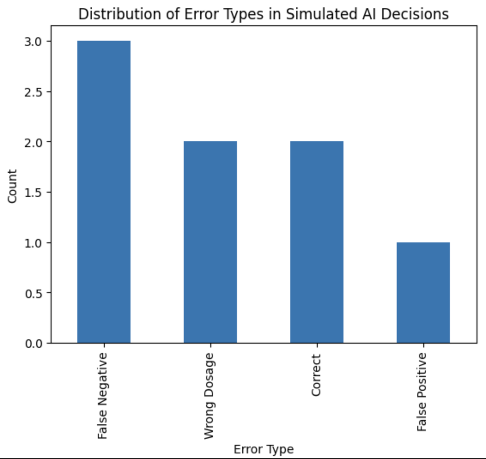

**Paper**
DOI: 10.5281/zenodo.19342171
ArXiv: https://arxiv.org/abs/2604.01449
Zenodo: https://zenodo.org/records/19342172

**AI Realiabilty in Medication Decision Systems**

This repository contains the experimental implementation supporting the paper:

**When AI Gets It Wrong: Reliability and Risk in AI-Assisted Medication Decision Systems**

**Overview**

This project demonstrates how diffrent types of AI errors (false negative, false positive, and dosage errors) can lead to significantly diffrent levels of risk in healthcare contexts.

**Results**

**Contents**
- simulated dataset of medication decision scenarios.
- Analysis of error types.
- Visualisation of error distribution.

**Key Insight**
The results highlight that aggregate performance metrics can obscure high-risk failure models, particulary in safety-critical domains such as healthcare.

**How to Run**
1. Install dependencies:
    pip install -r requirements.txt
2. Run the notebook:
    analysis.ipynb

**Reproducibilty**
This repository provides the dataset and notebook used to simualte AI decision-making scenarios and analyse error types.

**Author**
Khalid Adnan Alsayed

